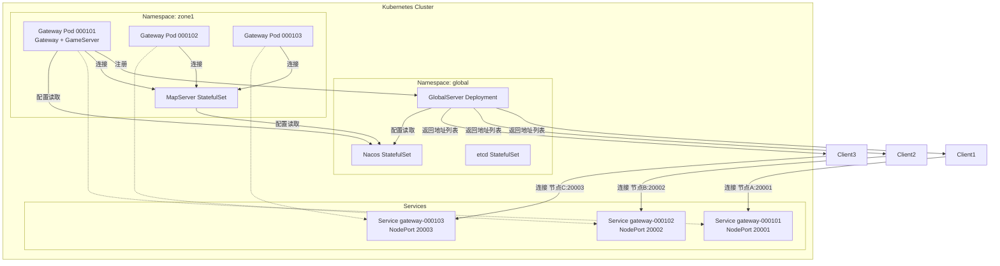

# 分布式游戏服务器框架设计方案

**版本**: 4.0  
**最后更新**: 2026-02-28  
**作者**: zGameFramework Team

---

## 目录

- [一、整体架构](#一整体架构)
  - [1.1 架构图](#11-架构图)
  - [1.2 架构设计理念](#12-架构设计理念)
  - [1.3 通信链路说明](#13-通信链路说明)
- [二、核心概念](#二核心概念)
  - [2.1 GameServer 分组机制](#21-gameserver-分组机制)
  - [2.2 选服与角色绑定](#22-选服与角色绑定)
  - [2.3 登录流程](#23-登录流程)
- [三、各服务器详细设计](#三各服务器详细设计)
  - [3.1 GlobalServer (全局服)](#31-globalserver-全局服)
  - [3.2 GatewayServer (网关服)](#32-gatewayserver-网关服)
  - [3.3 GameServer (游戏服)](#33-gameserver-游戏服)
  - [3.4 MapServer (地图服)](#34-mapserver-地图服)
- [四、地图模式设计](#四地图模式设计)
  - [4.1 地图类型定义](#41-地图类型定义)
  - [4.2 本服地图](#42-本服地图)
  - [4.3 跨服地图](#43-跨服地图)
  - [4.4 镜像地图](#44-镜像地图)
  - [4.5 地图配置数据库设计](#45-地图配置数据库设计)
- [五、会话管理](#五会话管理)
  - [5.1 会话状态定义](#51-会话状态定义)
  - [5.2 会话数据结构](#52-会话数据结构)
  - [5.3 会话生命周期](#53-会话生命周期)
  - [5.4 断线重连机制](#54-断线重连机制)
  - [5.5 多端登录管理](#55-多端登录管理)
  - [5.6 会话安全策略](#56-会话安全策略)
- [六、服务间通信协议](#六服务间通信协议)
  - [6.1 服务发现 - etcd](#61-服务发现---etcd)
  - [6.2 服务间通信 - TCP + Protobuf](#62-服务间通信---tcp--protobuf)
  - [6.3 客户端通信](#63-客户端通信)
- [七、数据库设计](#七数据库设计)
  - [7.1 数据库架构](#71-数据库架构)
  - [7.2 数据库选型](#72-数据库选型)
  - [7.3 GlobalDB 详细设计](#73-globaldb-详细设计)
  - [7.4 GameDB 详细设计](#74-gamedb-详细设计)
  - [7.5 MapDB 详细设计](#75-mapdb-详细设计)
- [八、核心系统设计](#八核心系统设计)
  - [8.1 游戏对象系统](#81-游戏对象系统)
  - [8.2 组件系统 (ECS)](#82-组件系统-ecs)
  - [8.3 事件系统](#83-事件系统)
  - [8.4 服务系统](#84-服务系统)
  - [8.5 游戏系统](#85-游戏系统)
- [九、项目结构建议](#九项目结构建议)
- [十、部署架构](#十部署架构)
- [十一、待讨论的问题](#十一待讨论的问题)
- [十二、总结](#十二总结)

---

## 一、整体架构

### 1.1 架构图

```
┌─────────────────────────────────────────────────────────────────────────────┐
│                             客户端层                                          │
│ ┌──────────────┐ ┌──────────────┐ ┌──────────────┐                         │
│ │  Client 1   │ │  Client 2   │ │  Client N   │                         │
│ └──────┬───────┘ └──────┬───────┘ └──────┬───────┘                         │
└─────────┼──────────────────┼──────────────────┼─────────────────────────────┘
          │                  │                  │
          │ 阶段1：登录      │                  │
          └──────────────────┴──────────────────┘
                             │
                             │
┌─────────────────────────────────────────────────────────────────────────────┐
│                       GlobalServer (全局服)                                  │
│ ┌──────────────────────────────────────────────────────────────────────┐  │
│ │ - HTTP 登录验证 (账号密码/第三方登录)                                  │  │
│ │ - Token 生成/验证                                                       │  │
│ │ - 游戏服列表管理 (含 Gateway 地址)                                      │  │
│ │ - 独立数据库 (GlobalDB)                                                │  │
│ └──────────────────────────────────────────────────────────────────────┘  │
└─────────────────────────────────────────────────────────────────────────────┘
                             │
                             │ 阶段2：选服后
                             │
┌─────────────────────────────────────────────────────────────────────────────┐
│                 网关服+游戏服 (Gateway + GameServer 1:1)                    │
│ ┌──────────────────────────────────────────────────────────────────────┐  │
│ │                     GameServer Group 1 (组ID=1)                      │  │
│ │ ┌──────────────────────┐ ┌──────────────────────┐ ┌──────────────┐ │  │
│ │ │Gateway 000101        │ │Gateway 000102        │ │Gateway ...  │ │  │
│ │ │┌──────────────────┐ │ │┌──────────────────┐ │ │              │ │  │
│ │ ││GameServer 000101│ │ ││GameServer 000102│ │ │              │ │  │
│ │ ││- 玩家数据       │ │ ││- 玩家数据       │ │ │              │ │  │
│ │ ││- 游戏逻辑       │ │ ││- 游戏逻辑       │ │ │              │ │  │
│ │ ││- 服务管理       │ │ ││- 服务管理       │ │ │              │ │  │
│ │ ││- 事件系统       │ │ ││- 事件系统       │ │ │              │ │  │
│ │ │└──────────────────┘ │ │└──────────────────┘ │ │              │ │  │
│ │ └──────────────────────┘ └──────────────────────┘ └──────────────┘ │  │
│ └──────────────────────────────────────────────────────────────────────┘  │
└─────────────────────────────────────────────────────────────────────────────┘
                             │
                             └─────────────────────────┬─────────────────────────┘
                                                       │
┌─────────────────────────────────────────────────────────────────────────────┐
│                         地图层 (Map)                                          │
│ ┌──────────────────────────────────────────────────────────────────────┐  │
│ │                     MapServer Group 1 (组ID=1)                       │  │
│ │ ┌──────────────────┐ ┌──────────────────┐                          │  │
│ │ │  MapServer 1    │ │  MapServer 2    │                          │  │
│ │ │- 地图1/2/3      │ │- 地图4/5/6      │                          │  │
│ │ │- 场景同步        │ │- 场景同步        │                          │  │
│ │ │- 游戏对象        │ │- 游戏对象        │                          │  │
│ │ │- 组件系统        │ │- 组件系统        │                          │  │
│ │ └──────────────────┘ └──────────────────┘                          │  │
│ └──────────────────────────────────────────────────────────────────────┘  │
│ ┌──────────────────────────────────────────────────────────────────────┐  │
│ │                     MapServer Group 2 (组ID=2)                       │  │
│ │ ┌──────────────────┐                                                  │  │
│ │ │  MapServer 3    │                                                  │  │
│ │ │- 地图1/2/3      │                                                  │  │
│ │ │- 场景同步        │                                                  │  │
│ │ │- 游戏对象        │                                                  │  │
│ │ │- 组件系统        │                                                  │  │
│ │ └──────────────────┘                                                  │  │
│ └──────────────────────────────────────────────────────────────────────┘  │
└─────────────────────────────────────────────────────────────────────────────┘
                                   │
┌─────────────────────────────────────────────────────────────────────────────┐
│                         数据层                                                │
│ ┌──────────┐ ┌──────────┐ ┌──────────┐ ┌──────────┐                      │
│ │GlobalDB  │ │GameDB    │ │GameDB    │ │MapDB     │                      │
│ │(全局)    │ │00101     │ │00102     │ │(地图)    │                      │
│ └──────────┘ └──────────┘ └──────────┘ └──────────┘                      │
└─────────────────────────────────────────────────────────────────────────────┘
```

### 1.2 架构设计理念

1. **服务拆分** - 按职责拆分为全局服、网关服、游戏服、地图服
2. **Gateway 与 GameServer 1:1** - 每个 GameServer 对应一个 Gateway，简化连接关系
3. **两阶段登录** - 阶段1通过 HTTP 连 GlobalServer 登录，阶段2选服后连对应 Gateway
4. **GameServer 分组** - 多个 GameServer 组成一组，共享 MapServer
5. **选服机制** - 玩家登录后选择 GameServer，角色与 GameServer 绑定
6. **层次化通信** - Gateway 只与对应 GameServer 通信，MapServer 只与 GameServer 通信
7. **GameServer 作为协调者** - 所有玩家操作经过 GameServer，便于数据一致性和事务处理
8. **水平扩展** - Gateway+GameServer 作为整体单元扩展，地图服支持多实例
9. **独立数据库** - 全局服有独立数据库，每个 GameServer 有独立数据库
10. **跨服支持** - 同组内不同 GameServer 的玩家可进入同一个 MapServer，实现跨服玩法
11. **组件化架构** - 采用 ECS 模式，实现功能模块化和灵活扩展
12. **事件驱动** - 实现基于事件的游戏逻辑处理
13. **服务化设计** - 实现核心游戏服务，职责清晰，易于维护

### 1.3 通信链路说明

- **阶段1 (登录)**：Client → HTTP API → GlobalServer (登录验证、获取游戏服列表)
- **阶段2 (游戏)**：Client → Gateway → GameServer (1:1 对应，游戏逻辑、地图消息转发)
- **GameServer ↔ MapServer** (地图场景管理、场景同步)
- **GameServer ↔ GlobalServer** (服务注册、状态上报、全局通知)

---

## 二、核心概念

### 2.1 GameServer 分组机制

#### 2.1.1 基本概念

- **GameServer ID**：每个 GameServer 有唯一的服 ID（如 000101、000102、000103）
- **GameServer Group ID**：多个 GameServer 可以组成一个组，拥有相同的组 ID
- **MapServer Group ID**：MapServer 也按组划分，与 GameServer 组对应

**重要限制：**
- 同组内 GameServer 最多 **99 个**
- 整个游戏最多支持 **9999 个分组**

#### 2.1.2 GameServer ID 分配规则

**格式**：`GroupID (4位) + ServerIndex (2位) = 6位 GameServer ID`

```
示例：
Group 1:
  - GameServer 000101 (组ID=1, 组内序号=1)
  - GameServer 000102 (组ID=1, 组内序号=2)
  ...
  - GameServer 000199 (组ID=1, 组内序号=99)

Group 123:
  - GameServer 012301 (组ID=123, 组内序号=1)
  - GameServer 012302 (组ID=123, 组内序号=2)
  ...
  - GameServer 012399 (组ID=123, 组内序号=99)

Group 9999:
  - GameServer 999901 (组ID=9999, 组内序号=1)
  - GameServer 999902 (组ID=9999, 组内序号=2)
  ...
  - GameServer 999999 (组ID=9999, 组内序号=99)
```

**解析 GameServer ID：**
```
GameServer ID: 000105
  ├─ 前4位: 0001 → GroupID = 1
  └─ 后2位: 05   → ServerIndex = 5
```

**优点：**
- 从 GameServer ID 可以直接看出所属 GroupID（前4位）
- 从 GameServer ID 可以直接看出组内序号（后2位）
- 支持最多 9999 个组，每组 99 个服

#### 2.1.3 分组规则

```
示例：
GameServer Group 1 (group_id=1):
  - GameServer 000101 (组ID=1)
  - GameServer 000102 (组ID=1)
  - GameServer 000103 (组ID=1)

MapServer Group 1:
  - MapServer 1 (组ID=1, 负责地图 1-10)
  - MapServer 2 (组ID=1, 负责地图 11-20)

GameServer Group 2 (group_id=2):
  - GameServer 000201 (组ID=2)
  - GameServer 000202 (组ID=2)

MapServer Group 2:
  - MapServer 3 (组ID=2, 负责地图 1-20)
```

#### 2.1.4 跨服玩法范围

- **同组内**：同组 GameServer 的玩家可以进入同组的 MapServer，互相可见、可交互
- **跨组**：不同组 GameServer 的玩家默认不可见，如需跨组交互需要特殊处理

### 2.2 选服与角色绑定

#### 2.2.1 角色与 GameServer 绑定

- **角色归属**：每个角色有且仅有一个 game_server_id，归属于固定的 GameServer
- **角色数据**：角色数据存储在对应 GameServer 的数据库中
- **跨服**：角色可以进入同组的其他 MapServer，但数据仍归属于原 GameServer

### 2.3 登录流程

#### 2.3.1 完整登录/选服流程

```
┌─────────────────────────────────────────────────────────────────────────┐
│                     阶段 1：HTTP 登录验证                                │
├─────────────────────────────────────────────────────────────────────────┤
│                                                                         │
│ 1. 客户端启动 → 直接连接固定域名 global.example.com                    │
│ 2. 客户端发送 HTTP 登录请求（账号密码/第三方登录）                     │
│ 3. 负载均衡器将请求分发到健康的 GlobalServer 实例                       │
│ 4. GlobalServer 验证登录凭据                                           │
│ 5. GlobalServer 生成 JWT Token                                         │
│ 6. GlobalServer 返回：                                                   │
│    - Token                                                             │
│    - 游戏服列表（每个服含 Gateway 地址）                               │
│ 7. 客户端显示游戏服列表供玩家选择                                       │
│ 8. 玩家选择 GameServer（如 000101）                                    │
│ 9. 客户端获取该 GameServer 对应的 Gateway 地址                          │
│                                                                         │
└─────────────────────────────────────────────────────────────────────────┘
                              ↓
┌─────────────────────────────────────────────────────────────────────────┐
│                   阶段 2：连接 Gateway 进入游戏                          │
├─────────────────────────────────────────────────────────────────────────┤
│                                                                         │
│  9. 客户端断开与 GlobalServer 的 HTTP 连接                              │
│ 10. 客户端连接选中的 Gateway（如 Gateway 000101）                      │
│ 11. 客户端发送会话凭证（Token + 选中的 GameServer ID）                  │
│ 12. Gateway 验证 Token（本地验证或调用 GlobalServer 验证）             │
│ 13. Gateway 将客户端绑定到对应的 GameServer 000101                      │
│ 14. Gateway 通知 GameServer 000101：有新玩家连接                       │
│ 15. GameServer 000101 加载该账号在本服的角色列表                       │
│ 16. 客户端显示角色列表（或创建新角色）                                   │
│ 17. 玩家选择/创建角色，进入游戏                                         │
│ 18. 游戏消息：Client ↔ Gateway 000101 ↔ GameServer 000101            │
│                                                                         │
└─────────────────────────────────────────────────────────────────────────┘
```

---

## 三、各服务器详细设计

### 3.1 GlobalServer (全局服)

#### 3.1.1 职责

**重要说明：GlobalServer 仅负责账号管理和服务器状态管理，不处理任何游戏逻辑**

- **HTTP 登录接口**（账号密码/第三方登录）
- 账号注册/登录验证
- **第三方登录支持**（QQ、微信、微博等）
- **第三方账号绑定/解绑**
- Token 生成与验证（JWT）
- **游戏服列表管理**（含对应 Gateway 地址）
- **游戏服信息查询**
- 账号信息管理
- 登录日志记录

#### 3.1.2 接口设计 (Protobuf)

```protobuf
syntax = "proto3";

package global;

// 账号注册请求
message AccountRegisterRequest {
    string username = 1;
    string password = 2;
    string email = 3;
    string phone = 4;
    string device_id = 5;
}

// 账号注册响应
message AccountRegisterResponse {
    int32 code = 1;
    string message = 2;
    int64 account_id = 3;
}

// 账号登录请求
message AccountLoginRequest {
    string username = 1;
    string password = 2;
    string device_id = 3;
    string device_info = 4;
}

// 账号登录响应
message AccountLoginResponse {
    int32 code = 1;             // 状态码
    string message = 2;          // 提示信息
    string token = 3;            // JWT Token
    int64 account_id = 4;        // 账号ID
}

// 游戏服信息
message GameServerInfo {
    int32 server_id = 1;         // GameServer ID
    int32 group_id = 2;          // 所属组 ID
    string server_name = 3;       // 服务器名称
    string server_status = 4;     // 状态：normal/maintenance/full
    int32 player_count = 5;       // 当前在线人数
    int32 max_players = 6;        // 最大人数
    string recommend = 7;         // 推荐标签：new/hot/recommend
    string gateway_address = 8;   // 对应 Gateway 地址
    int32 gateway_port = 9;       // 对应 Gateway 端口
}

// 获取游戏服列表请求
message GetGameServerListRequest {
    string token = 1;            // JWT Token
}

// 获取游戏服列表响应
message GetGameServerListResponse {
    int32 code = 1;
    string message = 2;
    repeated GameServerInfo servers = 3; // 游戏服列表
}

// 选服请求
message SelectGameServerRequest {
    string token = 1;            // JWT Token
    int32 game_server_id = 2;    // 选中的 GameServer ID
}

// 选服响应
message SelectGameServerResponse {
    int32 code = 1;
    string message = 2;
    string gateway_address = 3;   // 分配的 Gateway 地址
    int32 gateway_port = 4;       // 分配的 Gateway 端口
}

// Token 验证请求
message VerifyTokenRequest {
    string token = 1;            // JWT Token
}

// Token 验证响应
message VerifyTokenResponse {
    int32 code = 1;
    string message = 2;
    int64 account_id = 3;
    bool valid = 4;
}

// 刷新 Token 请求
message RefreshTokenRequest {
    string token = 1;            // JWT Token
}

// 刷新 Token 响应
message RefreshTokenResponse {
    int32 code = 1;
    string message = 2;
    string new_token = 3;        // 新 Token
}

// 第三方登录请求
message ThirdPartyLoginRequest {
    string platform = 1;          // 平台：qq/wechat/weibo等
    string open_id = 2;           // 第三方平台的唯一标识
    string access_token = 3;      // 第三方访问令牌
    string device_id = 4;
    string device_info = 5;
}

// 第三方登录响应
message ThirdPartyLoginResponse {
    int32 code = 1;               // 状态码：0=成功，1=需要绑定手机号/邮箱
    string message = 2;
    string token = 3;             // JWT Token（登录成功时返回）
    int64 account_id = 4;         // 账号ID（登录成功时返回）
    bool need_bind = 5;           // 是否需要绑定已有账号
}

// 绑定第三方账号请求
message BindThirdPartyAccountRequest {
    string token = 1;             // JWT Token（已登录用户）
    string platform = 2;          // 平台：qq/wechat/weibo等
    string open_id = 3;           // 第三方平台的唯一标识
    string access_token = 4;      // 第三方访问令牌
}

// 绑定第三方账号响应
message BindThirdPartyAccountResponse {
    int32 code = 1;
    string message = 2;
}

// 解绑第三方账号请求
message UnbindThirdPartyAccountRequest {
    string token = 1;             // JWT Token
    string platform = 2;          // 平台：qq/wechat/weibo等
}

// 解绑第三方账号响应
message UnbindThirdPartyAccountResponse {
    int32 code = 1;
    string message = 2;
}

// 获取已绑定的第三方账号列表请求
message GetBoundThirdPartyAccountsRequest {
    string token = 1;             // JWT Token
}

// 第三方账号绑定信息
message ThirdPartyAccountBinding {
    string platform = 1;          // 平台
    string open_id = 2;           // 第三方唯一标识
    string nickname = 3;          // 第三方昵称（可选）
    string avatar = 4;            // 头像URL（可选）
    int64 bind_time = 5;          // 绑定时间
}

// 获取已绑定的第三方账号列表响应
message GetBoundThirdPartyAccountsResponse {
    int32 code = 1;
    string message = 2;
    repeated ThirdPartyAccountBinding bindings = 3;
}

// 全局服务
service GlobalService {
    rpc Register(AccountRegisterRequest) returns (AccountRegisterResponse);
    rpc Login(AccountLoginRequest) returns (AccountLoginResponse);
    rpc ThirdPartyLogin(ThirdPartyLoginRequest) returns (ThirdPartyLoginResponse);
    rpc BindThirdPartyAccount(BindThirdPartyAccountRequest) returns (BindThirdPartyAccountResponse);
    rpc UnbindThirdPartyAccount(UnbindThirdPartyAccountRequest) returns (UnbindThirdPartyAccountResponse);
    rpc GetBoundThirdPartyAccounts(GetBoundThirdPartyAccountsRequest) returns (GetBoundThirdPartyAccountsResponse);
    rpc GetGameServerList(GetGameServerListRequest) returns (GetGameServerListResponse);
    rpc SelectGameServer(SelectGameServerRequest) returns (SelectGameServerResponse);
    rpc VerifyToken(VerifyTokenRequest) returns (VerifyTokenResponse);
    rpc RefreshToken(RefreshTokenRequest) returns (RefreshTokenResponse);
}
```

#### 3.1.3 第三方登录流程

**流程说明：**

```
1. 客户端调用第三方SDK（QQ/微信等）获取授权码
2. 客户端使用授权码向第三方平台换取 access_token 和 open_id
3. 客户端将 platform、open_id、access_token 发送给 GlobalServer
4. GlobalServer 验证第三方令牌的有效性
5. 根据 platform + open_id 查询 third_party_accounts 表：
   - 已绑定：直接登录成功，返回 token
   - 未绑定：创建新账号或引导用户绑定已有账号
6. 记录登录日志
```

**安全考虑：**
- 第三方 access_token 需要加密存储（如使用 AES）
- 定期清理过期的 access_token
- 限制同一第三方账号的绑定次数
- 支持解绑功能，但至少保留一种登录方式

#### 3.1.4 游戏服状态上报机制

**上报频率：**
- GameServer 每 **5 秒** 向 GlobalServer 上报一次状态
- 上报内容包括：在线人数、服务器负载、状态信息

### 3.2 GatewayServer (网关服)

#### 3.2.1 职责

**Gateway 的核心定位：客户端接入层，作为 GameServer 的"代言人"**

| 分类 | 具体职责 | 详细说明 |
|------|---------|---------|
| **连接管理** | 接受客户端连接 | 支持 TCP、WebSocket 等多种协议 |
| | 连接生命周期管理 | 建立、保持、关闭连接 |
| | 连接心跳保活 | 定期检测连接状态，清理死连接 |
| | 连接限流 | 限制单个 IP/账号的连接数 |
| **协议处理** | 协议编解码 | 处理客户端协议（如自定义二进制、Protobuf） |
| | 协议版本兼容 | 支持多版本客户端协议 |
| | 协议转换 | 客户端协议 ↔ 内部服务协议 |
| **安全防护** | Token 验证 | 验证从 GlobalServer 获得的 JWT Token |
| | 会话管理 | 维护玩家会话状态 |
| | 黑名单/白名单 | IP 黑名单、账号黑名单 |
| | 防 DDoS | 限制连接频率、消息频率 |
| | 数据加密 | 可选：支持 TLS/WSS 加密 |
| **消息转发** | 客户端 → GameServer | 转发客户端请求到对应 GameServer |
| | GameServer → 客户端 | 转发 GameServer 响应到客户端 |
| | 消息队列 | GameServer 不可用时暂存消息（可选） |
| | 消息优先级 | 高优先级消息优先转发（如背包、战斗） |
| **监控与运维** | 连接 metrics | 连接数、在线人数、连接时长分布 |
| | 消息 metrics | 消息量、消息大小、延迟分布 |
| | 日志记录 | 连接日志、错误日志、安全日志 |
| | 链路追踪 | 配合 Trace ID 做全链路追踪 |
| **配置与管理** | 热加载配置 | 限流规则、黑名单等配置热更新 |
| | 健康检查 | 提供健康检查接口 |
| | 优雅关闭 | 关闭时通知客户端，等待消息处理完成 |
| **定位约束** | 1:1 对应 GameServer | 每个 Gateway 只服务一个 GameServer |
| | 不与 GlobalServer 长连接 | 登录阶段已完成，无需保持连接 |
| | 不直接与 MapServer 通信 | 所有地图消息经过 GameServer 中转 |

#### 3.2.2 消息路由规则

```
客户端消息流向：
Client -> Gateway -> 对应的 GameServer (所有游戏逻辑和地图操作)

服务端消息流向：
GameServer -> Gateway -> Client (包含地图场景同步消息)
```

**重要说明：**
- Gateway 不与 GlobalServer 保持长连接（登录阶段已完成）
- Gateway 不直接与 MapServer 通信
- 所有地图相关的消息都经过 GameServer 中转
- GameServer 负责协调 MapServer 的通信和数据同步

### 3.3 GameServer (游戏服)

#### 3.3.1 职责

- 玩家数据管理（加载、保存）
- 游戏逻辑处理（任务、背包、技能等）
- 管理 MapServer（创建、销毁地图实例）
- 玩家进入/离开地图
- **与 MapServer 通信协调** - 转发地图消息、同步玩家数据
- **消息中转** - 接收客户端地图操作并转发到 MapServer，接收 MapServer 场景同步并转发给客户端
- 跨服数据同步
- 独立数据库 (GameDB)
- **服务管理** - 管理 PlayerService、GuildService、AuctionService、MapService 等
- **事件系统** - 实现基于事件的游戏逻辑处理
- **组件系统** - 采用 ECS 模式，实现功能模块化

### 3.4 MapServer (地图服)

#### 3.4.1 职责

- 地图场景管理
- AOI (Area of Interest) 管理
- 玩家移动同步
- 场景对象交互
- 怪物 AI
- 技能释放与碰撞检测
- **游戏对象管理** - 管理地图内的所有游戏对象
- **组件系统** - 实现 ECS 模式的组件管理
- **事件系统** - 处理地图内的游戏事件

---

## 四、地图模式设计

### 4.1 地图类型定义

定义三种地图模式：

| 地图类型 | 说明 | 玩家可见范围 | 适用场景 |
|---------|------|------------|---------|
| **本服地图** (Single-Server Map) | 只有本服玩家可以进入 | 仅同 GameServer 玩家 | 主城、新手村、日常任务地图 |
| **跨服地图** (Cross-Server Map) | 同组多个服的玩家可以进入 | 同 GameServer 组所有玩家 | 世界地图、跨服活动、战场 |
| **镜像地图** (Mirrored Map) | 地图有多个镜像实例，玩家可任选一个 | 仅同镜像内玩家 | 副本、活动地图、高负载地图 |

### 4.2 本服地图

**特点：**
- 每个 GameServer 有自己的独立地图实例
- 只有本服玩家可见、可交互
- 数据完全由所属 GameServer 管理

**适用场景：**
- 主城
- 新手村
- 帮派驻地
- 个人/小队副本

**实现方式：**
```
GameServer 000101 (组ID=1) → MapServer 1 (组ID=1) → 地图 1_000101_1 (主城-000101)
GameServer 000102 (组ID=1) → MapServer 1 (组ID=1) → 地图 1_000102_1 (主城-000102)
GameServer 000201 (组ID=2) → MapServer 3 (组ID=2) → 地图 2_000201_1 (主城-000201)
```

### 4.3 跨服地图

**特点：**
- 同 GameServer 组内多个服的玩家共享同一张地图
- 所有同组玩家可见、可交互
- 地图归属 GameServer 组，不归属于单个服

**适用场景：**
- 世界地图
- 跨服活动
- 跨服战场
- 世界 Boss

**实现方式：**
```
GameServer 000101 (组ID=1) ─┐
GameServer 000102 (组ID=1) ─┼→ MapServer 1 (组ID=1) → 地图 1_2 (世界地图-组1)
GameServer 000103 (组ID=1) ─┘

GameServer 000201 (组ID=2) ─┐
GameServer 000202 (组ID=2) ─┼→ MapServer 3 (组ID=2) → 地图 2_2 (世界地图-组2)
```

### 4.4 镜像地图

**特点：**
- 地图有多个独立的镜像实例
- 玩家可选择或被分配到某个镜像
- **玩家可手动创建镜像**（如开启副本）
- 同一镜像内的玩家可见、可交互
- 不同镜像间玩家隔离

**镜像创建方式：**

| 创建方式 | 说明 | 适用场景 |
|---------|------|---------|
| **系统自动创建** | 系统根据负载自动创建/销毁镜像 | 活动地图、高负载地图 |
| **玩家手动创建** | 玩家主动创建专属镜像 | 团队副本、私人副本 |

**适用场景：**
- **团队副本**（玩家手动创建）
- **私人副本**（玩家手动创建）
- **活动地图**（系统自动创建）
- **高负载地图**（系统自动创建）
- **节日活动**（系统自动创建）

**镜像管理：**
- 自动扩容：所有镜像达到 80% 负载时，自动创建新镜像
- 自动缩容：低峰期合并镜像，释放资源
- 镜像状态：normal（正常）/ full（满员）/ maintenance（维护）

### 4.5 地图配置数据库设计

**map_configs 表：**
```sql
CREATE TABLE map_configs (
    map_id INT PRIMARY KEY,
    map_name VARCHAR(64) NOT NULL,
    map_type VARCHAR(32) NOT NULL,   -- single_server/cross_server/mirrored
    group_id INT,                    -- 所属 GameServer 组 ID（跨服/镜像地图用）
    max_players INT DEFAULT 1000,     -- 单镜像最大人数
    mirror_count INT DEFAULT 1,        -- 系统自动创建的镜像数量（镜像地图用）
    allow_player_create BOOLEAN DEFAULT FALSE,  -- 是否允许玩家手动创建镜像
    max_player_mirrors INT DEFAULT 5,  -- 单个玩家最多同时创建的镜像数
    max_daily_mirrors INT DEFAULT 10, -- 单个玩家每天最多创建的镜像数
    mirror_lifetime INT DEFAULT 3600,  -- 空镜像自动销毁时间（秒）
    scene_data TEXT,                   -- 场景数据（JSON/二进制）
    create_time BIGINT NOT NULL,
    update_time BIGINT
);
```

**map_mirrors 表（镜像地图实例管理）：**
```sql
CREATE TABLE map_mirrors (
    mirror_id BIGINT PRIMARY KEY AUTO_INCREMENT,
    map_id INT NOT NULL,
    mirror_index INT NOT NULL,       -- 镜像序号 1,2,3...
    map_server_id INT NOT NULL,      -- 运行在哪个 MapServer
    game_group_id INT NOT NULL,      -- 所属 GameServer 组 ID
    creator_player_id BIGINT,        -- 创建者玩家ID（玩家手动创建时）
    mirror_type VARCHAR(32) DEFAULT 'system',  -- system/player
    current_players INT DEFAULT 0,
    max_players INT DEFAULT 1000,
    status VARCHAR(32) DEFAULT 'normal',  -- normal/full/maintenance
    last_player_leave_time BIGINT,   -- 最后一个玩家离开时间
    create_time BIGINT NOT NULL,
    update_time BIGINT,
    INDEX idx_map_id (map_id),
    INDEX idx_map_server (map_server_id),
    INDEX idx_game_group (game_group_id),
    INDEX idx_creator (creator_player_id),
    INDEX idx_mirror_type (mirror_type)
);
```

**map_server_mappings 表（地图与 MapServer 映射）：**
```sql
CREATE TABLE map_server_mappings (
    id BIGINT PRIMARY KEY AUTO_INCREMENT,
    map_id INT NOT NULL,
    map_server_id INT NOT NULL,
    game_group_id INT NOT NULL,
    map_instance_id VARCHAR(64),      -- 地图实例ID（如 1_000101_1、1_2、1_3_1）
    create_time BIGINT NOT NULL,
    UNIQUE KEY idx_map_instance (map_instance_id),
    INDEX idx_map_server (map_server_id),
    INDEX idx_game_group (game_group_id)
);
```

---

## 五、会话管理

### 5.1 会话状态定义

```
┌─────────────────────────────────────────────────────────────────────────┐
│                         会话状态流转图                                  │
├─────────────────────────────────────────────────────────────────────────┤
│                                                                         │
│  NEW (新连接) → LOGGING_IN (登录中) → LOGGED_IN (已登录)             │
│                                                                         │
│                                                                         │
│                                                                         │
│                                          ↓                             │
│                              SELECTING_SERVER (选服中)                  │
│                                                                         │
│                                                                         │
│                                          ↓                             │
│                              IN_GAME (游戏中)                          │
│                                                                         │
│                                                                         │
│    DISCONNECTED (已断开) ←───────────────────────────────────────────│
│                                                                         │
│  状态说明：                                                              │
│  - NEW: 连接刚建立，未验证                                              │
│  - LOGGING_IN: 正在登录验证                                            │
│  - LOGGED_IN: 登录成功，等待选服                                       │
│  - SELECTING_SERVER: 正在选服或已选服等待进入                          │
│  - IN_GAME: 游戏中                                                     │
│  - DISCONNECTED: 连接断开，会话保留（可重连）                          │
└─────────────────────────────────────────────────────────────────────────┘
```

### 5.2 会话数据结构

**Gateway 本地 Session（内存）：**
```go
type Session struct {
    // 基础信息
    SessionID     string        // 会话唯一标识（UUID）
    ConnectionID  string        // 连接ID
    ClientAddr    string        // 客户端IP:Port

    // 账号信息
    AccountID     int64         // 账号ID
    PlayerID      int64         // 玩家ID（选服后）
    GameServerID  int32         // 绑定的GameServer ID

    // 登录信息
    LoginType     string        // 登录类型：normal/qq/wechat等
    LoginTime     int64         // 登录时间
    DeviceID      string        // 设备ID
    DeviceInfo    string        // 设备信息（设备型号、系统版本等）

    // 状态管理
    Status        SessionStatus // 会话状态
    LastActiveTime int64       // 最后活跃时间
    HeartbeatCount int64       // 心跳计数

    // 重连相关
    ReconnectToken string       // 重连令牌
    ReconnectExpire int64      // 重连令牌过期时间

    // 安全相关
    IP            string        // 登录IP
    IPRegion      string        // IP归属地
    IsSecure      bool          // 是否安全登录
}

type SessionStatus int

const (
    SessionStatusNew SessionStatus = iota
    SessionStatusLoggingIn
    SessionStatusLoggedIn
    SessionStatusSelectingServer
    SessionStatusInGame
    SessionStatusDisconnected
)
```

### 5.3 会话生命周期

**会话创建：**
```
1. 客户端连接 Gateway
2. Gateway 生成 SessionID
3. 创建本地 Session 对象
4. 状态设置为 NEW
5. 等待登录验证
```

**心跳保活：**
```
- 客户端每 15 秒发送心跳
- Gateway 更新 last_active_time
- 30 秒无心跳 → 标记为可能断开
- 60 秒无心跳 → 主动断开连接，状态设为 DISCONNECTED
```

**会话清理：**
```
- 连接断开后，会话在 Redis 中保留 5 分钟（可重连）
- 5 分钟后 Redis 自动过期
- 主动踢人/注销时立即清理
```

### 5.4 断线重连机制

**重连流程：**
```
1. 客户端检测到断开连接
2. 保存上次的 reconnect_token（登录时获取）
3. 重新连接 Gateway
4. 发送重连请求
5. Gateway 验证重连令牌
6. Gateway 恢复会话
7. 同步数据
8. 重连成功，生成新的 reconnect_token
```

### 5.5 多端登录管理

**策略选择：**

| 策略 | 说明 | 适用场景 |
|------|------|---------|
| **互斥登录** | 同一账号只能一个设备在线，新登录踢掉旧的 | 重度游戏，防止多开 |
| **并发登录** | 同一账号可多个设备同时在线 | 轻度游戏，多端协同 |
| **同设备允许** | 同一设备可多次登录，不同设备互斥 | 平衡方案 |

**推荐方案：同设备允许 + 不同设备互斥**

### 5.6 会话安全策略

**1. 会话劫持防护**
- 绑定 device_id + IP（IP变化时触发验证）
- 敏感操作（充值、删除角色）需重新验证
- 会话ID随机化（UUID v4）
- HTTPS/WSS 加密传输

**2. 异常登录检测**
- 异地登录检测（IP地域变化）
- 异常时间登录（非常规时段）
- 异常设备登录（新设备）

---

## 六、服务间通信协议

### 6.1 服务发现 - etcd

- **服务注册**：服务器启动时注册到 etcd
- **服务发现**：客户端通过 etcd 发现服务地址
- **健康检查**：定期上报健康状态
- **负载均衡**：基于服务健康状态和负载情况

**注册信息：**
```json
{
  "service": "gameserver",
  "id": "000101",
  "group": "1",
  "address": "192.168.1.100",
  "port": 8001,
  "status": "healthy",
  "load": 0.3,
  "players": 1234
}
```

### 6.2 服务间通信 - TCP + Protobuf

**通信流程：**
1. 建立 TCP 连接
2. 发送长度前缀 + 消息内容
3. 接收方解析长度前缀，读取消息内容
4. 反序列化为 Protobuf 对象
5. 处理业务逻辑
6. 序列化响应消息
7. 发送响应

**消息格式：**
```
+----------------+----------------+----------------+
| 长度 (4 bytes) | 命令 (2 bytes) | 数据 (N bytes) |
+----------------+----------------+----------------+
```

**协议版本：**
- 支持多版本协议
- 版本协商机制
- 向后兼容

### 6.3 客户端通信

**支持的协议：**
- **TCP**：传统二进制协议
- **WebSocket**：支持浏览器和移动设备
- **HTTP**：用于登录和部分API

**协议选择：**
- 客户端根据环境选择合适的协议
- 优先使用 WebSocket（支持跨平台）
- 传统 TCP 用于性能要求高的场景

**数据压缩：**
- 支持 gzip 压缩
- 针对大消息自动压缩
- 压缩阈值可配置

---

## 七、数据库设计

### 7.1 数据库架构

- **GlobalDB**：存储账号、全局配置等
- **GameDB**：每个 GameServer 对应一个，存储玩家、公会等数据
- **MapDB**：存储地图、实例等数据
- **Redis**：缓存热点数据，管理会话

### 7.2 数据库选型

| 数据库 | 用途 | 选型理由 |
|--------|------|---------|
| **MySQL** | GlobalDB, GameDB | 关系型数据库，适合存储结构化数据，支持事务 |
| **MongoDB** | MapDB | 文档型数据库，适合存储非结构化数据，如地图数据、实例数据 |
| **Redis** | 缓存、会话管理 | 内存数据库，适合存储热点数据和会话信息 |

### 7.3 GlobalDB 详细设计

**核心表结构：**

**accounts 表：**
```sql
CREATE TABLE accounts (
    account_id BIGINT PRIMARY KEY AUTO_INCREMENT,
    username VARCHAR(64) UNIQUE NOT NULL,
    password_hash VARCHAR(128) NOT NULL,
    email VARCHAR(128) UNIQUE,
    phone VARCHAR(32) UNIQUE,
    registered_at BIGINT NOT NULL,
    last_login_at BIGINT,
    last_login_ip VARCHAR(32),
    status INT DEFAULT 0, -- 0: normal, 1: banned, 2: frozen
    login_count INT DEFAULT 0,
    device_id VARCHAR(128),
    device_info TEXT
);
```

**third_party_accounts 表：**
```sql
CREATE TABLE third_party_accounts (
    id BIGINT PRIMARY KEY AUTO_INCREMENT,
    account_id BIGINT NOT NULL,
    platform VARCHAR(32) NOT NULL, -- qq/wechat/weibo
    open_id VARCHAR(128) NOT NULL,
    access_token VARCHAR(256) NOT NULL, -- 加密存储
    refresh_token VARCHAR(256), -- 加密存储
    expires_at BIGINT,
    nickname VARCHAR(64),
    avatar VARCHAR(256),
    bind_time BIGINT NOT NULL,
    UNIQUE KEY idx_platform_openid (platform, open_id),
    FOREIGN KEY (account_id) REFERENCES accounts(account_id) ON DELETE CASCADE
);
```

**game_servers 表：**
```sql
CREATE TABLE game_servers (
    server_id INT PRIMARY KEY,
    group_id INT NOT NULL,
    server_name VARCHAR(64) NOT NULL,
    status VARCHAR(32) DEFAULT 'normal', -- normal/maintenance/full
    max_players INT DEFAULT 5000,
    current_players INT DEFAULT 0,
    gateway_address VARCHAR(64) NOT NULL,
    gateway_port INT NOT NULL,
    game_address VARCHAR(64) NOT NULL,
    game_port INT NOT NULL,
    created_at BIGINT NOT NULL,
    updated_at BIGINT,
    INDEX idx_group_id (group_id)
);
```

**login_logs 表：**
```sql
CREATE TABLE login_logs (
    id BIGINT PRIMARY KEY AUTO_INCREMENT,
    account_id BIGINT NOT NULL,
    login_time BIGINT NOT NULL,
    logout_time BIGINT,
    login_ip VARCHAR(32),
    login_type VARCHAR(32), -- normal/qq/wechat
    device_id VARCHAR(128),
    device_info TEXT,
    status INT DEFAULT 0, -- 0: success, 1: failed
    error_message VARCHAR(256),
    FOREIGN KEY (account_id) REFERENCES accounts(account_id) ON DELETE CASCADE
);
```

### 7.4 GameDB 详细设计

**核心表结构：**

**players 表：**
```sql
CREATE TABLE players (
    player_id BIGINT PRIMARY KEY AUTO_INCREMENT,
    account_id BIGINT NOT NULL,
    game_server_id INT NOT NULL,
    player_name VARCHAR(64) NOT NULL,
    level INT DEFAULT 1,
    experience BIGINT DEFAULT 0,
    gold BIGINT DEFAULT 0,
    diamond BIGINT DEFAULT 0,
    vip_level INT DEFAULT 0,
    created_at BIGINT NOT NULL,
    last_login_at BIGINT,
    last_logout_at BIGINT,
    position_x FLOAT DEFAULT 0,
    position_y FLOAT DEFAULT 0,
    position_z FLOAT DEFAULT 0,
    map_id INT DEFAULT 1,
    status INT DEFAULT 0, -- 0: normal, 1: banned, 2: frozen
    UNIQUE KEY idx_account_server (account_id, game_server_id),
    INDEX idx_game_server (game_server_id)
);
```

**player_items 表：**
```sql
CREATE TABLE player_items (
    id BIGINT PRIMARY KEY AUTO_INCREMENT,
    player_id BIGINT NOT NULL,
    item_id INT NOT NULL,
    count INT DEFAULT 1,
    position INT, -- 背包位置
    equipped BOOLEAN DEFAULT FALSE,
    created_at BIGINT NOT NULL,
    updated_at BIGINT,
    FOREIGN KEY (player_id) REFERENCES players(player_id) ON DELETE CASCADE,
    INDEX idx_player_id (player_id)
);
```

**player_skills 表：**
```sql
CREATE TABLE player_skills (
    id BIGINT PRIMARY KEY AUTO_INCREMENT,
    player_id BIGINT NOT NULL,
    skill_id INT NOT NULL,
    level INT DEFAULT 1,
    experience INT DEFAULT 0,
    created_at BIGINT NOT NULL,
    updated_at BIGINT,
    FOREIGN KEY (player_id) REFERENCES players(player_id) ON DELETE CASCADE,
    UNIQUE KEY idx_player_skill (player_id, skill_id),
    INDEX idx_player_id (player_id)
);
```

**guilds 表：**
```sql
CREATE TABLE guilds (
    guild_id BIGINT PRIMARY KEY AUTO_INCREMENT,
    game_server_id INT NOT NULL,
    guild_name VARCHAR(64) NOT NULL,
    leader_id BIGINT NOT NULL,
    level INT DEFAULT 1,
    experience BIGINT DEFAULT 0,
    member_count INT DEFAULT 1,
    max_members INT DEFAULT 50,
    created_at BIGINT NOT NULL,
    updated_at BIGINT,
    UNIQUE KEY idx_server_name (game_server_id, guild_name),
    INDEX idx_game_server (game_server_id)
);
```

**guild_members 表：**
```sql
CREATE TABLE guild_members (
    id BIGINT PRIMARY KEY AUTO_INCREMENT,
    guild_id BIGINT NOT NULL,
    player_id BIGINT NOT NULL,
    role INT DEFAULT 0, -- 0: member, 1: vice-leader, 2: leader
    contribution INT DEFAULT 0,
    join_time BIGINT NOT NULL,
    last_active_at BIGINT,
    FOREIGN KEY (guild_id) REFERENCES guilds(guild_id) ON DELETE CASCADE,
    FOREIGN KEY (player_id) REFERENCES players(player_id) ON DELETE CASCADE,
    UNIQUE KEY idx_guild_player (guild_id, player_id),
    INDEX idx_guild_id (guild_id),
    INDEX idx_player_id (player_id)
);
```

### 7.5 MapDB 详细设计

**核心表结构：**

**map_instances 表：**
```sql
CREATE TABLE map_instances (
    instance_id BIGINT PRIMARY KEY AUTO_INCREMENT,
    map_id INT NOT NULL,
    map_server_id INT NOT NULL,
    game_group_id INT NOT NULL,
    instance_type VARCHAR(32) DEFAULT 'normal', -- normal/instance/battlefield
    status VARCHAR(32) DEFAULT 'active', -- active/inactive
    created_at BIGINT NOT NULL,
    started_at BIGINT,
    ended_at BIGINT,
    max_players INT DEFAULT 1000,
    current_players INT DEFAULT 0,
    INDEX idx_map_id (map_id),
    INDEX idx_map_server (map_server_id),
    INDEX idx_game_group (game_group_id)
);
```

**map_objects 表：**
```sql
CREATE TABLE map_objects (
    object_id BIGINT PRIMARY KEY AUTO_INCREMENT,
    instance_id BIGINT NOT NULL,
    object_type VARCHAR(32) NOT NULL, -- player/monster/npc/item
    object_data JSON NOT NULL, -- 存储对象详细数据
    position_x FLOAT DEFAULT 0,
    position_y FLOAT DEFAULT 0,
    position_z FLOAT DEFAULT 0,
    created_at BIGINT NOT NULL,
    updated_at BIGINT,
    deleted_at BIGINT,
    INDEX idx_instance_id (instance_id),
    INDEX idx_object_type (object_type)
);
```

**spawn_points 表：**
```sql
CREATE TABLE spawn_points (
    id BIGINT PRIMARY KEY AUTO_INCREMENT,
    map_id INT NOT NULL,
    spawn_type VARCHAR(32) NOT NULL, -- monster/npc/item
    spawn_id INT NOT NULL, -- 怪物/NPC/物品ID
    position_x FLOAT DEFAULT 0,
    position_y FLOAT DEFAULT 0,
    position_z FLOAT DEFAULT 0,
    respawn_time INT DEFAULT 300, -- 刷新时间（秒）
    max_count INT DEFAULT 1, -- 最大数量
    current_count INT DEFAULT 0,
    active BOOLEAN DEFAULT TRUE,
    created_at BIGINT NOT NULL,
    updated_at BIGINT,
    INDEX idx_map_id (map_id),
    INDEX idx_spawn_type (spawn_type)
);
```

---

## 八、核心系统设计

### 8.1 游戏对象系统

**设计理念：**
- 采用层次化对象模型
- 支持组件化扩展
- 实现事件驱动

**核心类结构：**

```go
// GameObject 基础游戏对象
type GameObject struct {
    BaseObject        // 提供ID管理
    name             string
    objectType       GameObjectType
    position         Vector3
    isActive         bool
    eventEmitter     *EventBus
    components       *ComponentManager
    mapObject        IMap
}

// LivingObject 有生命的游戏对象
type LivingObject struct {
    GameObject
    health           float32
    maxHealth        float32
    mana             float32
    maxMana          float32
    level            int
    experience       float32
    properties       map[string]float32
}

// Player 玩家对象
type Player struct {
    LivingObject
    accountID        int64
    playerName       string
    guildID          int64
    inventory        *Inventory
    skills           []*Skill
    quests           []*Quest
    pets             []*Pet
}

// Monster 怪物对象
type Monster struct {
    LivingObject
    monsterID        int
    aiType           string
    dropItems        []*DropItem
    aggroRange       float32
    patrolPath       []Vector3
}

// NPC 对象
type NPC struct {
    LivingObject
    npcID            int
    dialogues        []*Dialogue
    quests           []*Quest
    vendorItems      []*VendorItem
}
```

**对象生命周期：**
1. 创建：通过 ObjectManager 创建对象
2. 初始化：设置属性、添加组件
3. 激活：加入地图，开始更新
4. 更新：每帧调用 Update 方法
5. 销毁：移除地图，清理资源

### 8.2 组件系统 (ECS)

**设计理念：**
- 组件化设计，功能模块化
- 数据与行为分离
- 支持动态添加/移除组件

**核心组件：**

| 组件类型 | 功能 | 适用对象 |
|---------|------|---------|
| **PositionComponent** | 位置管理 | 所有游戏对象 |
| **HealthComponent** | 生命值管理 | 玩家、怪物、NPC |
| **ManaComponent** | 法力值管理 | 玩家、NPC |
| **InventoryComponent** | 背包管理 | 玩家 |
| **SkillComponent** | 技能管理 | 玩家、怪物 |
| **QuestComponent** | 任务管理 | 玩家 |
| **GuildComponent** | 公会管理 | 玩家 |
| **AIComponent** | AI行为管理 | 怪物、NPC |
| **PathfindingComponent** | 寻路管理 | 怪物、NPC |
| **CollisionComponent** | 碰撞检测 | 所有游戏对象 |

**组件管理器：**
```go
type ComponentManager struct {
    owner         IGameObject
    components    map[string]IComponent
}

func (cm *ComponentManager) AddComponent(component IComponent) {
    // 添加组件
}

func (cm *ComponentManager) GetComponent(componentID string) IComponent {
    // 获取组件
}

func (cm *ComponentManager) RemoveComponent(componentID string) {
    // 移除组件
}

func (cm *ComponentManager) Update(deltaTime float64) {
    // 更新所有组件
}
```

### 8.3 事件系统

**设计理念：**
- 发布/订阅模式
- 松耦合的事件处理
- 支持同步和异步事件

**核心功能：**
- 事件注册：订阅事件
- 事件发布：触发事件
- 事件处理：执行事件回调
- 事件优先级：控制事件处理顺序

**事件类型：**

| 事件类型 | 描述 | 触发时机 |
|---------|------|---------|
| **PlayerLogin** | 玩家登录 | 玩家成功登录时 |
| **PlayerLogout** | 玩家登出 | 玩家登出时 |
| **PlayerLevelUp** | 玩家升级 | 玩家等级提升时 |
| **PlayerDeath** | 玩家死亡 | 玩家生命值为0时 |
| **MonsterDeath** | 怪物死亡 | 怪物生命值为0时 |
| **ItemPickup** | 拾取物品 | 玩家拾取物品时 |
| **SkillCast** | 释放技能 | 玩家释放技能时 |
| **QuestComplete** | 任务完成 | 任务条件达成时 |
| **GuildCreate** | 公会创建 | 公会创建成功时 |
| **GuildJoin** | 加入公会 | 玩家加入公会时 |

**事件系统实现：**
```go
type EventBus struct {
    listeners    map[string][]EventListener
}

func (eb *EventBus) Register(eventType string, listener EventListener) {
    // 注册事件监听器
}

func (eb *EventBus) Unregister(eventType string, listener EventListener) {
    // 取消注册
}

func (eb *EventBus) Publish(eventType string, data interface{}) {
    // 发布事件
}
```

### 8.4 服务系统

**设计理念：**
- 服务化设计，职责清晰
- 依赖注入，松耦合
- 支持服务发现和注册

**核心服务：**

| 服务名称 | 职责 | 实现文件 |
|---------|------|---------|
| **PlayerService** | 玩家管理 | player/player_service.go |
| **GuildService** | 公会管理 | guild/guild_service.go |
| **AuctionService** | 拍卖系统 | auction/auction_service.go |
| **MapService** | 地图管理 | maps/map_service.go |
| **SkillService** | 技能系统 | systems/skill/skill_system.go |
| **CombatService** | 战斗系统 | systems/combat/combat_system.go |
| **AIService** | AI系统 | systems/ai/ai_system.go |
| **MovementService** | 移动系统 | systems/movement/movement_system.go |
| **PropertyService** | 属性系统 | systems/property/property_system.go |
| **BuffService** | Buff系统 | systems/buff/buff_system.go |

**服务管理：**
```go
type ServiceManager struct {
    services    map[string]IService
}

func (sm *ServiceManager) RegisterService(name string, service IService) {
    // 注册服务
}

func (sm *ServiceManager) GetService(name string) IService {
    // 获取服务
}

func (sm *ServiceManager) StartAllServices() {
    // 启动所有服务
}

func (sm *ServiceManager) StopAllServices() {
    // 停止所有服务
}
```

### 8.5 游戏系统

#### 8.5.1 AI 系统

**设计理念：**
- 行为树设计
- 状态机管理
- 可配置的AI行为

**核心功能：**
- 寻路：A* 寻路算法
- 感知：范围检测，目标选择
- 决策：基于行为树的决策
- 行动：移动、攻击、技能释放

**AI类型：**
- **被动型**：只在被攻击时反击
- **主动型**：主动寻找目标攻击
- **巡逻型**：在指定区域巡逻
- **精英型**：更复杂的AI行为，如技能组合
- **Boss型**：具有阶段变化的复杂AI

#### 8.5.2 战斗系统

**设计理念：**
- 实时战斗
- 技能组合
- 伤害计算

**核心功能：**
- 伤害计算：基于属性和技能
- 战斗状态：生命值、法力值、buff/debuff
- 技能释放：技能冷却、消耗、效果
- 战斗判定：命中、暴击、闪避
- 战斗奖励：经验、物品掉落

**战斗流程：**
1. 玩家选择目标
2. 释放技能
3. 计算伤害
4. 更新目标状态
5. 处理战斗结果

#### 8.5.3 技能系统

**设计理念：**
- 技能树设计
- 技能效果组合
- 技能升级

**核心功能：**
- 技能学习：通过技能点学习
- 技能升级：提升技能等级和效果
- 技能释放：消耗法力值，产生效果
- 技能冷却：技能使用后的冷却时间
- 技能组合：多个技能的连续使用

**技能类型：**
- **伤害技能**：直接造成伤害
- **治疗技能**：恢复生命值
- **控制技能**：眩晕、沉默、减速等
- **辅助技能**：增益buff，减益debuff
- **召唤技能**：召唤宠物或单位

#### 8.5.4 移动系统

**设计理念：**
- 平滑移动
- 碰撞检测
- 路径规划

**核心功能：**
- 位置同步：客户端与服务器位置同步
- 碰撞检测：与地形和其他对象的碰撞
- 路径规划：自动寻路到目标位置
- 移动状态：行走、奔跑、飞行等

**移动同步：**
- 客户端预测：客户端预测移动轨迹
- 服务器验证：服务器验证移动合法性
- 位置修正：服务器纠正客户端位置

#### 8.5.5 属性系统

**设计理念：**
- 属性计算
- Buff/Debuff管理
- 属性成长

**核心属性：**
- **力量**：影响物理伤害
- **智力**：影响魔法伤害和法力值
- **敏捷**：影响攻击速度和闪避
- **耐力**：影响生命值和防御力
- **精神**：影响法力恢复和技能冷却

**属性计算：**
- 基础属性：角色等级和种族提供
- 装备属性：装备提供的属性加成
- Buff/Debuff：临时属性变化
- 天赋属性：通过天赋系统获得的属性

#### 8.5.6 Buff系统

**设计理念：**
- 持续效果
- 叠加机制
- 效果管理

**核心功能：**
- Buff添加：应用buff效果
- Buff更新：每帧更新buff状态
- Buff移除：移除buff效果
- Buff叠加：处理buff的叠加规则

**Buff类型：**
- **增益buff**：提升属性或能力
- **减益debuff**：降低属性或能力
- **持续伤害**：持续造成伤害
- **持续治疗**：持续恢复生命值
- **控制效果**：眩晕、沉默、减速等

---

## 九、项目结构建议

```
zMmoServer/
├── GlobalServer/           # 全局服
│   ├── api/               # HTTP API
│   ├── config/            # 配置
│   ├── db/                # 数据库
│   ├── handler/           # 请求处理器
│   ├── service/           # 服务
│   ├── util/              # 工具
│   ├── go.mod             # 依赖管理
│   └── main.go            # 启动入口
├── GatewayServer/         # 网关服
│   ├── config/            # 配置
│   ├── handler/           # 请求处理器
│   ├── protocol/           # 协议处理
│   ├── service/           # 服务
│   ├── util/              # 工具
│   ├── go.mod             # 依赖管理
│   └── main.go            # 启动入口
├── GameServer/            # 游戏服
│   ├── client/            # 客户端连接管理
│   ├── config/            # 配置
│   ├── db/                # 数据库
│   ├── game/              # 游戏核心逻辑
│   │   ├── object/        # 游戏对象
│   │   ├── component/     # 组件系统
│   │   ├── event/         # 事件系统
│   │   ├── service/       # 游戏服务
│   │   └── system/        # 游戏系统
│   ├── handler/           # 请求处理器
│   ├── protocol/          # 协议处理
│   ├── service/           # 服务
│   ├── util/              # 工具
│   ├── go.mod             # 依赖管理
│   └── main.go            # 启动入口
├── MapServer/             # 地图服
│   ├── config/            # 配置
│   ├── game/              # 游戏逻辑
│   │   ├── map/           # 地图管理
│   │   ├── object/        # 游戏对象
│   │   ├── component/     # 组件系统
│   │   ├── event/         # 事件系统
│   │   └── system/        # 游戏系统
│   ├── handler/           # 请求处理器
│   ├── protocol/          # 协议处理
│   ├── service/           # 服务
│   ├── util/              # 工具
│   ├── go.mod             # 依赖管理
│   └── main.go            # 启动入口
├── common/                # 公共模块
│   ├── config/            # 公共配置
│   ├── db/                # 数据库工具
│   ├── protocol/          # 公共协议
│   ├── util/              # 公共工具
│   └── go.mod             # 依赖管理
├── docs/                  # 文档
│   ├── 架构设计方案.md       # 架构设计文档
│   ├── 数据库设计.md         # 数据库设计文档
│   └── API文档.md           # API文档
├── scripts/               # 脚本
│   ├── build.sh           # 构建脚本
│   ├── deploy.sh          # 部署脚本
│   └── monitor.sh         # 监控脚本
└── docker/                # Docker配置
    ├── Dockerfile         # Dockerfile
    └── docker-compose.yml # Docker Compose配置
```

---

## 十、Kubernetes 部署运维详细设计

### 10.1 总体设计原则

- **容器化**：所有服务（GlobalServer、GatewayServer、GameServer、MapServer）打包为 Docker 镜像。
- **编排管理**：使用 Kubernetes 进行容器编排，实现自动化部署、扩缩容、自愈。
- **声明式配置**：所有资源配置（Deployment、StatefulSet、Service、ConfigMap、Secret）存储在 Git 仓库，通过 GitOps（如 ArgoCD）同步。
- **环境隔离**：按大区（Zone）划分 Kubernetes Namespace，实现逻辑隔离。
- **混合有状态/无状态**：Gateway、GameServer 无状态化（数据分离），MapServer 有状态化（使用 StatefulSet + PVC）。
- **配置中心**：引入 Nacos 或 etcd 作为动态配置中心，实现配置热更新。
- **服务发现**：内部服务使用 Kubernetes DNS + Headless Service；外部服务通过 Ingress/LoadBalancer 暴露，客户端直连 Gateway 采用**节点端口直连**方案。
- **性能优先**：Gateway 与 GameServer 同 Pod 部署，客户端直连 Gateway，无中间转发，保障最低延迟。

### 10.2 集群规划

#### 10.2.1 集群拓扑

建议采用**多可用区（AZ）**部署，保证高可用。每个大区（Zone）可对应一个独立的 Kubernetes 集群或同一集群内的独立 Namespace。

| 环境      | 集群数量 | 命名空间划分                      | 说明                     |
| :-------- | :------- | :-------------------------------- | :----------------------- |
| 开发/测试 | 1        | 按功能（global, zone1, zone2...） | 共享集群，资源隔离       |
| 生产      | 多集群   | 每个集群承载多个大区              | 按物理区域或大区规模拆分 |

#### 10.2.2 节点池设计

根据服务类型划分节点池，优化资源利用和调度：

| 节点池名称 | 标签          | 用途                                        | 实例类型推荐          |
| :--------- | :------------ | :------------------------------------------ | :-------------------- |
| `global`   | `role=global` | 运行 GlobalServer、etcd、Nacos 等控制面服务 | 通用型（CPU 密集）    |
| `game`     | `role=game`   | 运行 Gateway + GameServer 组合              | 计算型（高 CPU/内存） |
| `map`      | `role=map`    | 运行 MapServer（有状态）                    | 计算型 + 本地 SSD     |
| `db`       | `role=db`     | 运行 MySQL、Redis、MongoDB（可选）          | 内存/IO 优化型        |

通过节点亲和性（nodeAffinity）将服务调度到对应节点池。

### 10.3 服务部署模式

#### 10.3.1 GlobalServer

- **类型**：无状态 HTTP 服务
- **部署**：使用 Deployment，副本数 ≥2（高可用）
- **暴露方式**：ClusterIP Service + Ingress（对外提供 HTTP API）
- **Ingress 配置**：使用域名 `global.example.com`，TLS 终止，负载均衡算法可配置

#### 10.3.2 Gateway 与 GameServer 1:1 组合

**核心设计**：每个 GameServer 对应一个 Gateway，两者部署在同一个 Pod 内（两个容器），共享网络命名空间，通过 `localhost` 通信，实现最低延迟。

**对外暴露方式**：采用**节点端口直连方案**，即每个 Gateway Pod 通过 NodePort Service 对外暴露唯一的端口，客户端直接连接该 Service 的节点 IP + NodePort，无中间转发层。

##### 10.3.2.1 节点端口分配策略

- **端口范围**：为避免与系统端口冲突，统一使用 **20000-30000** 区间，总计 10001 个端口。
- **端口计算**：根据 GameServer ID 的后几位计算 NodePort，例如 `NodePort = 20000 + (server_id % 10000)`。由于 GameServer ID 是 6 位数字，后四位取值范围 0000-9999，可覆盖 10000 个端口，与端口范围匹配。
- **同节点端口冲突避免**：通过 Pod 调度约束保证同一节点上不会出现两个相同端口的 Pod。使用 `podAntiAffinity` 以 `server_id / 100` 作为分组键，确保相同分组（即相同端口段）的 Pod 不会调度到同一节点。

##### 10.3.2.2 Service 定义

为每个 Gateway Pod 创建一个独立的 NodePort Service，使用预计算的 NodePort，并设置 `externalTrafficPolicy: Local`，确保流量尽可能在本地节点转发，减少跨节点跳转。

```yaml
apiVersion: v1
kind: Service
metadata:
  name: gateway-000101
  namespace: zone1
spec:
  type: NodePort
  externalTrafficPolicy: Local
  selector:
    app: gameserver
    gameserver-id: "000101"
  ports:
  - port: 8000
    targetPort: 8000
    nodePort: 20001   # 固定分配
```


##### 10.3.2.3 Pod 模板设计

```yaml
apiVersion: apps/v1
kind: Deployment
metadata:
  name: gameserver-zone1-000101
  namespace: zone1
  labels:
    zone: zone1
    gameserver-id: "000101"
spec:
  replicas: 1
  selector:
    matchLabels:
      app: gameserver
      gameserver-id: "000101"
  template:
    metadata:
      labels:
        app: gameserver
        gameserver-id: "000101"
        zone: zone1
    spec:
      nodeSelector:
        role: game
      affinity:
        podAntiAffinity:
          preferredDuringSchedulingIgnoredDuringExecution:
          - weight: 100
            podAffinityTerm:
              labelSelector:
                matchExpressions:
                - key: gameserver-id
                  operator: In
                  values:
                  - "000100" # 此处需要动态计算分组，实际可通过 Operator 或控制器注入
              topologyKey: kubernetes.io/hostname
      containers:
      - name: gateway
        image: game/gateway:latest
        ports:
        - containerPort: 8000
        env:
        - name: GAMESERVER_ID
          value: "000101"
        - name: GAMESERVER_ADDR
          value: "127.0.0.1:8001"
        - name: NODE_IP
          valueFrom:
            fieldRef:
              fieldPath: status.hostIP
        - name: NODE_PORT
          value: "20001"
      - name: gameserver
        image: game/gameserver:latest
        ports:
        - containerPort: 8001
        env:
        - name: SERVER_ID
          value: "000101"
        - name: GAME_DB_DSN
          valueFrom:
            secretKeyRef:
              name: game-db-secret
              key: dsn
```


**说明**：

- 每个 Deployment 只管理一个副本，因为 Gateway 与 GameServer 是一对一的。若需扩缩容，必须增加新的 Deployment（对应新的 GameServer ID）。
- 通过环境变量将节点 IP 和 NodePort 注入容器，供 GameServer 向 GlobalServer 注册时使用。
- 实际生产环境建议使用 **Operator** 自动管理 GameServer 的创建和销毁，根据配置动态生成 Deployment 和 Service。

##### 10.3.2.4 Gateway 地址动态更新流程

1. Gateway 容器启动后，从环境变量获取节点 IP 和 NodePort。
2. GameServer 容器启动后，通过内部通信获取该信息，并向 GlobalServer 注册自己的 `节点IP:NodePort`。
3. GlobalServer 实时更新内存中的游戏服列表，并持久化到数据库。
4. 客户端登录时，从 GlobalServer 获取游戏服列表，其中每个服包含 Gateway 地址（节点 IP + 端口）。
5. 客户端选服后，直接连接该地址，建立 TCP 连接。

#### 10.3.3 可选：Gateway Router 方案（用于灰度或安全防护）

尽管直连方案是主流，但在以下场景中可引入 Gateway Router 作为补充层：

- **灰度发布**：通过 Router 将部分玩家流量切到新版本 Gateway。
- **DDoS 防护**：Router 可作为流量清洗节点。
- **跨地域路由**：根据客户端 IP 地理位置选择最近的节点。

Router 可采用高性能 L4 负载均衡器（如 **Cilium + BGP** 或 **云厂商 NLB**），配置为**直通模式（DSR）**，仅入向流量经 Router，响应流量直接返回客户端，以最大限度降低延迟。

#### 10.3.4 MapServer

MapServer 是有状态服务，每个实例负责一组地图，需要持久化存储。

- **部署**：使用 StatefulSet，确保稳定的网络标识（如 `map-zone1-0.map-svc.zone1.svc.cluster.local`）。
- **存储**：每个 Pod 挂载独立的 PersistentVolumeClaim（PVC），存储地图数据或缓存。
- **服务发现**：通过 Headless Service 暴露每个 Pod，供 GameServer 直接连接。
- **地图分配**：通过配置中心（Nacos）下发每个 MapServer 实例负责的地图 ID 列表，MapServer 启动时加载。

### 10.4 配置管理

#### 10.4.1 分层配置

- **静态基础配置**：如服务端口、日志级别，使用 ConfigMap 挂载或环境变量。
- **敏感信息**：如数据库密码，使用 Secret（可配合 External Secrets Operator 从 Vault 同步）。
- **动态业务配置**：如游戏活动开关、地图分配、数据库连接串模板，使用配置中心（Nacos 或 etcd）管理，服务启动时拉取并监听变更。

#### 10.4.2 配置中心部署

- 在 `global` 命名空间部署 Nacos 集群（StatefulSet + MySQL 持久化）。
- 服务通过环境变量 `CONFIG_SERVER_ADDR` 指定 Nacos 地址。
- 配置按命名空间（Namespace）和分组（Group）隔离：每个大区一个命名空间，每种服务类型一个分组。
- 例如：`zone1` 命名空间下，`gameserver` 分组存储数据库模板，`map` 分组存储地图分配规则。

#### 10.4.3 数据库连接串动态生成

GameServer 和 MapServer 的数据库连接串可能因实例而异。利用配置中心的占位符功能，服务启动时传入 `server_id` 或 `map_id`，从配置中心拉取模板并替换。例如：

```properties
# Nacos 中配置
db.url = jdbc:mysql://game-db-${ZONE_ID}.svc.cluster.local:3306/game_${SERVER_ID}
db.user = game
db.password = ${cipher}encryptedpass
```


服务启动时，通过环境变量传入 `ZONE_ID` 和 `SERVER_ID`，在代码中完成模板渲染。密码可加密存储，Nacos 支持解密插件。

### 10.5 服务发现

#### 10.5.1 内部服务发现

- **GameServer 发现 MapServer**：使用 Headless Service + DNS，通过 `map-svc-zone1` 获取所有 MapServer Pod IP 列表，再根据负载或地图 ID 选择。
- **Gateway 发现对应的 GameServer**：由于同 Pod，直接使用 localhost。
- **GlobalServer 发现 GameServer 状态**：GameServer 定期（如 5 秒）向 etcd 或 Nacos 上报状态，GlobalServer 从配置中心获取所有 GameServer 信息。

#### 10.5.2 外部服务发现

- 客户端通过域名（如 `global.example.com`）访问 GlobalServer。
- 客户端从 GlobalServer 获取每个 GameServer 的 Gateway 地址（节点 IP + NodePort），然后直接连接。

### 10.6 数据库部署

#### 10.6.1 数据库位置选择

**选项 A：在 Kubernetes 内部部署**

- 使用 StatefulSet 部署 MySQL、Redis、MongoDB，配合持久化存储和备份机制。
- 优点：统一管理，自动化运维。
- 缺点：对有状态数据库的运维要求高，需考虑备份恢复、高可用。

**选项 B：使用云数据库或外部专用数据库**

- 对于生产环境，推荐使用云厂商托管的数据库服务（如 RDS、Cloud SQL、Redis 集群），降低运维负担。
- 只需在 Kubernetes 中通过 Service Entry 或 ExternalName 暴露地址给内部服务。

#### 10.6.2 数据库连接配置

- 每个大区可部署独立的数据库实例（如 `game-db-zone1`、`game-db-zone2`）。
- 连接串通过 Secret 或配置中心下发，建议使用 **连接池中间件**（如 ProxySQL、PgBouncer）管理连接。

#### 10.6.3 备份与恢复

- 定期备份数据库到对象存储（如 AWS S3、MinIO）。
- 通过 Kubernetes CronJob 执行备份脚本。
- 制定恢复演练计划。

### 10.7 分组隔离与资源管理

#### 10.7.1 命名空间隔离

每个大区（Zone）对应一个 Kubernetes Namespace，例如 `zone1`、`zone2`。命名空间内包含该大区的 GameServer、MapServer 等资源。GlobalServer、Nacos、etcd 等全局组件放在 `global` 命名空间。

#### 10.7.2 资源配额

为每个 Namespace 设置 ResourceQuota，限制 CPU、内存、PVC 数量，防止单个大区耗尽集群资源。


```yaml
apiVersion: v1
kind: ResourceQuota
metadata:
  name: zone1-quota
  namespace: zone1
spec:
  hard:
    requests.cpu: "100"
    requests.memory: "200Gi"
    limits.cpu: "200"
    limits.memory: "400Gi"
    persistentvolumeclaims: "50"
```


#### 10.7.3 网络策略

使用 NetworkPolicy 限制跨命名空间访问，仅允许必要的通信（如 GameServer 访问 Global 命名空间中的 Nacos）。

### 10.8 监控与告警

#### 10.8.1 监控体系

- **Prometheus** + **Grafana**：采集节点、Pod、容器指标。
- **自定义指标**：暴露业务指标（在线人数、地图负载、消息延迟）供 HPA 和监控使用。
- **日志收集**：使用 Fluentd 或 Loki 收集容器日志，集中到 Elasticsearch 或 Grafana Loki。
- **链路追踪**：集成 Jaeger 或 SkyWalking，追踪跨服务调用链。

#### 10.8.2 告警

- 使用 AlertManager 配置告警规则，如 Pod 重启、高 CPU、数据库连接失败。
- 接入企业微信、钉钉或邮件通知。

### 10.9 扩缩容策略

#### 10.9.1 水平自动扩缩（HPA）

- **GlobalServer**：基于 QPS HPA。
- **Gateway Router**（如部署）：基于连接数或 CPU 使用率 HPA。
- **GameServer**：由于 GameServer 与 Gateway 1:1 绑定，扩缩容需以“组”为单位，增加或减少整个 Deployment（即新增一个 GameServer ID）。通常根据在线人数、服务器负载等指标由运营决策手动或定时扩缩。

#### 10.9.2 垂直扩缩（VPA）

- 对于 MapServer 等有状态服务，可结合 VPA 推荐资源，但通常需要手动调整。

#### 10.9.3 集群节点扩缩容

- 使用 Cluster Autoscaler，根据 Pod 调度需求自动增加或减少节点。

### 10.10 滚动更新与发布策略

#### 10.10.1 更新策略

- **Deployment**：使用 RollingUpdate，设置 maxSurge 和 maxUnavailable，确保平滑升级。
- **StatefulSet**：使用 RollingUpdate 或 OnDelete，对于 MapServer 可能需要分批更新，避免影响太多地图。

#### 10.10.2 蓝绿发布/金丝雀发布

- 可通过创建新版本 Deployment，逐步切流（配合 Service 的 label selector）实现金丝雀发布。
- 对于 GameServer，由于玩家数据绑定，建议先在一个组内灰度，观察无问题后再全量。

#### 10.10.3 版本回滚

- 利用 Kubernetes 的滚动更新历史记录，回滚 Deployment 或 StatefulSet。

### 10.11 备份与容灾

- **etcd 备份**：定期备份 Kubernetes 集群 etcd。
- **数据库备份**：如上所述。
- **跨集群容灾**：考虑多集群部署，通过 DNS 切换流量。

### 10.12 部署流程图




### 10.13 关键注意事项

1. **GameServer ID 生成与管理**：建议开发一个 Kubernetes Operator，根据配置（如大区、组、数量）自动创建对应的 Deployment 和 Service，并注入正确的 ID 和端口。
2. **端口唯一性保证**：通过调度约束（podAntiAffinity）确保同一节点上不会出现相同端口范围的 Pod。若使用 Operator，可在创建 Pod 前检查目标节点端口占用情况。
3. **客户端重连机制**：当 Gateway 因故障迁移导致地址变化时，客户端应能从 GlobalServer 重新获取最新地址。断线重连流程需支持这一场景。
4. **网络性能优化**：对于延迟敏感型游戏，可考虑使用 **SR-IOV** 或 **DPDK** 提升网络性能，或使用 **HostNetwork** 进一步减少网络开销（需权衡安全与隔离）。
5. **资源预留**：为系统组件（如 kubelet、容器运行时）预留 CPU/内存，保证节点稳定性。
6. **跨大区通信限制**：默认情况下不同 Namespace 的网络策略应限制不必要的跨大区访问，但需允许 GameServer 访问全局服务（GlobalServer、Nacos）。

### 10.14 不同环境部署建议

| 环境 | 集群规模         | 部署方式                                      | 数据库                       |
| :--- | :--------------- | :-------------------------------------------- | :--------------------------- |
| 开发 | 单节点或小型集群 | 简化版，使用 NodePort 或 port-forward         | 容器化数据库或本地数据库     |
| 测试 | 2-4 节点         | 接近生产，使用 LoadBalancer 暴露 GlobalServer | 独立数据库实例               |
| 生产 | 多节点多可用区   | 完整高可用架构，启用 HPA、Cluster Autoscaler  | 云托管数据库或自建高可用集群 |

---

## 十一、待讨论的问题

### 11.1 技术选型
- **编程语言**: Go 语言是否满足所有需求？是否需要混合其他语言？
- **数据库**: MongoDB 与 MySQL 的选择是否合理？是否需要引入其他数据库？
- **缓存**: Redis 是否满足缓存需求？是否需要引入其他缓存方案？

### 11.2 架构设计
- **服务拆分**: 当前服务拆分是否合理？是否需要进一步拆分？
- **通信协议**: TCP + Protobuf 是否满足性能需求？是否需要考虑其他协议？
- **跨服设计**: 跨服玩法的实现方案是否需要优化？

### 11.3 性能优化
- **网络优化**: 如何优化网络通信性能？
- **数据库优化**: 如何优化数据库读写性能？
- **内存优化**: 如何优化内存使用？
- **CPU 优化**: 如何优化 CPU 使用率？

### 11.4 安全考虑
- **防作弊**: 如何防止客户端作弊？
- **防 DDoS**: 如何防御 DDoS 攻击？
- **数据安全**: 如何保护玩家数据安全？
- **传输安全**: 如何确保传输安全？

### 11.5 运维管理
- **监控体系**: 如何建立完善的监控体系？
- **告警机制**: 如何建立有效的告警机制？
- **故障恢复**: 如何实现快速故障恢复？
- **版本管理**: 如何管理版本更新和回滚？

---

## 十二、总结

本架构设计方案整合了 program/server 和 zGameServer 的设计理念，实现了一个功能完整、性能优异、可扩展性强的分布式游戏服务器框架。

**核心优势：**
1. **分布式架构**: 服务拆分合理，支持水平扩展
2. **组件化设计**: 采用 ECS 模式，实现功能模块化和灵活扩展
3. **事件驱动**: 实现基于事件的游戏逻辑处理，降低耦合度
4. **服务化设计**: 核心游戏服务职责清晰，易于维护
5. **跨服支持**: 支持同组内跨服玩法，提升玩家体验
6. **多协议支持**: 支持 TCP、WebSocket、HTTP 等多种协议
7. **数据库优化**: 合理选择数据库类型，优化数据存储
8. **安全性**: 完善的会话管理和安全策略
9. **可部署性**: 支持容器化部署和自动扩缩容

**未来发展方向：**
1. **微服务化**: 进一步拆分服务，实现更细粒度的服务治理
2. **云原生**: 深度集成云服务，提升部署和运维效率
3. **AI 集成**: 引入 AI 技术，提升游戏体验
4. **性能优化**: 持续优化系统性能，提升玩家体验
5. **功能扩展**: 根据业务需求，逐步扩展游戏功能

本架构设计方案为 zMmoServer 的开发和实施提供了清晰的指导，确保系统能够满足未来游戏业务的需求。
